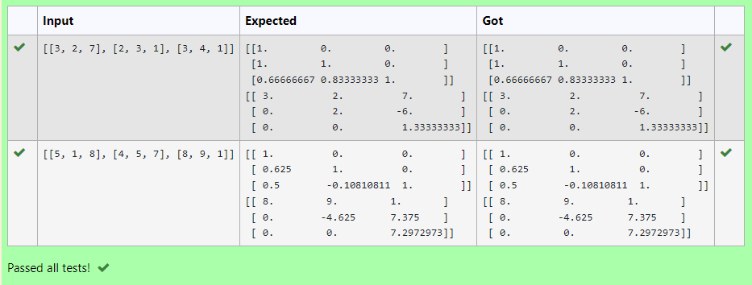
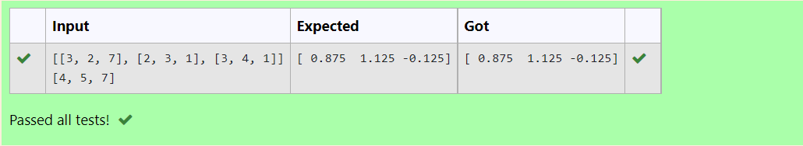

# LU Decomposition 

## AIM:
To write a program to find the LU Decomposition of a matrix.

## Equipments Required:
1. Hardware – PCs
2. Anaconda – Python 3.7 Installation / Moodle-Code Runner

## Algorithm
### 1. To Find L and U matrices with LU Decomposition
### Step 1:
Get the matrix from the user.

### Step 2:
Using "from scipy.linalg import lu" to import scipy (LU) module.

### Step 3:
Using "L,U=lu(a)" we can get the matrix of L and U.

### Step 4:
Print the result matrices (L and U Matrices).

### Step 5:
End of the Program.

### 2. To Find X matrix with LU Decomposition
### Step 1:
Get the matrix from the user.

### Step 2:
Using "from scipy.linalg import lu_factor,lu_solve" to import scipy module for factorization and solving X.

### Step 3:
Using "lu,piv=lu_factor(a)"

### Step 4:
Print the output(x matrix)

### Step 5:
End of the Program.

### Program:
```python
#Program to find L and U matrix using LU decomposition.
#Developed by: Aadhithya.M
#RegisterNumber: 22003465

# To print L and U matrix
import numpy as np
from scipy.linalg import lu
A = np.array(eval(input()))
P, L, U = lu(A)
print(L)
print(U)

#Program to solve a matrix using LU decomposition.
#Developed by: Aadhithya.M
#RegisterNumber: 22003465

#Program to print X matrix(Solution to the equations)
import numpy as np
from scipy.linalg import lu_factor, lu_solve
A = np.array(eval(input()))
B = np.array(eval(input()))
lu, pivot = lu_factor(A)
x = lu_solve((lu,pivot),B)
print(x)
```
## Output:



## Result:
Thus the program to find the LU Decomposition of a matrix is written and verified using python programming.

